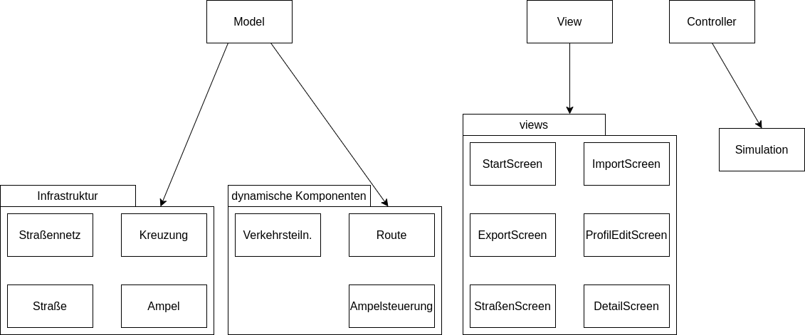

# Semesterprojekt Phase III - Verkehrssimulation

## Pakete

### Interfaces

- Model
  - Infrastruktur
    - Straßennetz
      -  getStraße(StraßenID)
      -  getKreuzung(KreuzungID)
      -  getKreuzung(Koordinaten)
      -  addStraße(Länge, Spuren, Start, Ende)
      -  setStraßen(Straßen[])
    - Straße
      - getLänge()
      - getAnzahlSpuren()
      - getStart()
      - getEnde()
    - Kreuzung
      - getStraßen()
      - istKreisverkehr()
      - getAmpeln()
      - addAmpel(Steuerung)
      - setAmpeln(Ampeln[])
    - Ampel
      - getFarbe()
      - setFarbe()
      - getKreuzung()    
  - dynamische Komponenten
    - Ampelsteuerung
      - getZustände(Kreuzung)
      - addAmpel(Ampel)
      - updateAmpel()
    - Verkersteilnehmer:innen
      - getPosition()
      - updatePosition()
      - getRoute()
      - setRoute()
    - Route
      - getAnfang()
      - getEnde()
      - getLänge()
      - setLänge()

- Controller
  - Simulation
    - createStau()
    - stauUmfahren()

